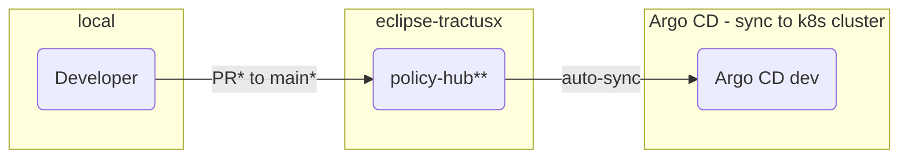

# Dev flow with deployment to dev environment

Note\* Every pull request (PR) requires at least one approving review by a committer

Note\*\* Unit tests and Sonarcloud runs at pull request, Trivy and KICS scans at merge as well as daily and Veracode scan runs weekly

Note\*\* Trivy and KICS scans are scheduled to daily

## NOTICE

This work is licensed under the [Apache-2.0](https://www.apache.org/licenses/LICENSE-2.0).

- SPDX-License-Identifier: Apache-2.0
- SPDX-FileCopyrightText: 2023 Contributors to the Eclipse Foundation
- Source URL: https://github.com/eclipse-tractusx/policy-hub
