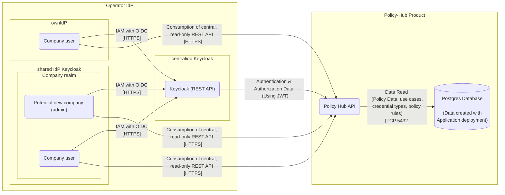

# Security Assessment Policy-Hub 

|                           |                                                                                                |
| ------------------------- | ---------------------------------------------------------------------------------------------- |
| Contact for product       | [@evegufy](https://github.com/evegufy)   [@jjeroch](https://github.com/jjeroch)             |
| Security responsible      | [Szymon Kowalczyk](szymon.kowalczyk@zf.com) |
| Version number of product |                                                                                           |
| Dates of assessment       | 2024-02-16: Assessment                                                                      |
| Status of assessment      | ASSESSMENT DRAFT                                                                            |

## Product Description

To be updated

### Important Links

To be updated

## Data Flow Diagram

### Changes compared to last Security Assessment

N/A

### Features for Upcoming Versions

N/A

## Threats & Risks

All potential threats discussed during the assessment were already mitigated.

### Mitigated Threats

To be updated.

### Performed Security Checks

To be updated

