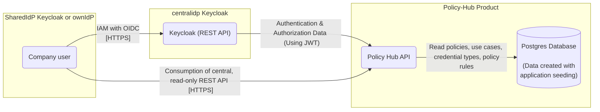

# Security Assessment Policy-Hub 

|                           |                                                                                                          |
| ------------------------- | -------------------------------------------------------------------------------------------------------- |
| Contact for product       | [@evegufy](https://github.com/evegufy)   [@jjeroch](https://github.com/jjeroch)                       |
| Security responsible      | [@szymonkowalczykzf](https://github.com/szymonkowalczykzf)   [@pablosec](https://github.com/pablosec) |
| Version number of product | 1.0.0                                                                                                    |
| Dates of assessment       | 2024-02-16: Assessment   2024-05-15 Re-Assessment for 1.0.0                                           |
| Status of assessment      | final                                                                                                    |

## Product Description

The Policy-Hub product is a read-only REST API project, without implementation of an UI. (Pure Backend Component)

The main purpose of the product is to provide interested and authenticated CX Users with read access to policy data, use cases, credential types and policy rules, which are created during an application seeding.

The Policy-Hub comprises the technical foundation for interaction, monitoring, auditing and further functionalities.

The product can be run anywhere: it can be deployed as a docker image, e. g. on Kubernetes (platform-independent, cloud, on prem or local).

The policy hub is using following key frameworks:

- .Net
- Entity Framework

[Development Concept](./Development%20Concept.md)

## Data Flow Diagram

### Changes compared to last Security Assessment

* upgrade to .NET 8
* new seeding data 

### Features for Upcoming Versions

N/A

## Threats & Risks

All potential threats discussed during the assessment were already mitigated.

### Mitigated Threats

N/A 

### Performed Security Checks

- Static Application Security Testing (SAST) - CodeQL
- Dynamic Application Security Testing (DAST) - OWASP ZAP
- Secret Scanning - GitGuardian
- Software Composition Analysis (SCA) - SNYK
- Container Scan conducted - Trivy
- Infrastructure as Code - KICS
- Securing code, dependencies, containers, IaC and Cloud Deployments - SNYK

## NOTICE

This work is licensed under the [Apache-2.0](https://www.apache.org/licenses/LICENSE-2.0).

- SPDX-License-Identifier: Apache-2.0
- SPDX-FileCopyrightText: 2024 Contributors to the Eclipse Foundation
- Source URL: https://github.com/eclipse-tractusx/policy-hub
