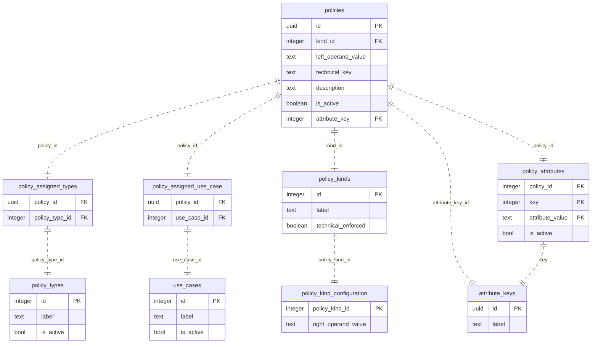

# Database View

- [Database View](#database-view)
  - [Database Overview](#database-overview)
  - [Database Structure](#database-structure)
    - [Enum Value Tables](#enum-value-tables)
    - [Mapping Tables](#mapping-tables)
    - [Configuration Table](#configuration-table)
    - [Attribute Mapping](#attribute-mapping)
    - [Policy Information](#policy-information)
  - [NOTICE](#notice)

## Database Overview

## Database Structure

The database is organized into several key tables, each serving a specific purpose:

### Enum Value Tables

`attribute_keys`, `policy_kinds`, `policy_types`, and `use_cases` are tables designed to store enum values. They contain an id and label, derived from the backend enums.

### Mapping Tables

`policy_assigned_types` and `policy_assigned_use_cases` are used to map types and use cases to specific policies.

### Configuration Table

The `policy_kind_configurations` table is utilized to define specific right operand values for each policy_kind.

### Attribute Mapping

In the `policy_attributes` table, specific attributes are mapped to policies. This allows for multiple attributes to be assigned to a single policy.

### Policy Information

The `policies` table serves as the repository for comprehensive information about each policy.

## NOTICE

This work is licensed under the [Apache-2.0](https://www.apache.org/licenses/LICENSE-2.0).

- SPDX-License-Identifier: Apache-2.0
- SPDX-FileCopyrightText: 2021-2023 Contributors to the Eclipse Foundation
- Source URL: https://github.com/eclipse-tractusx/policy-hub
